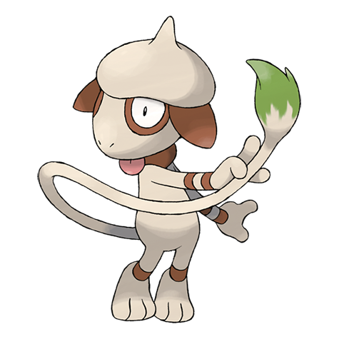

# PokePalette

Find pokemon that match your image's color palette! Upload any image and discover which Pokemon share similar colors using computer vision and color theory.



## What it does

Ever wondered which Pokemon would blend perfectly with your favorite photo? This CLI tool analyzes the dominant colors in any image and finds Pokemon with the most similar color palettes.

```bash
# Find Pokemon that match your sunset photo
pokepalette sunset.jpg -t 5

# Results:
# charizard
# moltres
# arcanine
# raikou -s
# charizard --form mega-y
```

Shiny variants are differentiated with -s. Different forms will be indicated with --form `<form>`. This format can be plugged directly into [**krabby**](https://github.com/yannjor/krabby).

## Usage:

```bash
pokepalette <IMAGE> [OPTIONS]
```

### Options

| Option                 | Description                              |
| ---------------------- | ---------------------------------------- |
| `-t, --top-k <NUMBER>` | Number of Pokemon returned (default: 10) |
| `--no-shiny`           | Filter out shinies                       |
| `--all-shiny`          | Filter out non-shinies                   |
| `--no-mega`            | Filter out megas                         |
| `--all-mega`           | Filter out non-megas                     |
| `--no-gmax`            | Filter out gmax                          |
| `--all-gmax`           | Filter out non-gmax                      |
| `--no-regional`        | Filter out regional variants             |

### Examples

```bash
# Basic usage - find top 10 matching Pokemon
pokepalette my_photo.jpg

# Get more results
pokepalette landscape.png -t 20
```

### Background

This project originally started as a small side-quest while I was ricing my Arch Linux setup with **neofetch** and **pywal**.  
I wanted to find Pokémon sprites that matched the colors of my terminal and wallpaper, but I couldn’t find any tool that did this automatically. So I decided to build one myself.

This tool is best paired with [**krabby**](https://github.com/yannjor/krabby), since the results are formatted to work directly with the `krabby` CLI tool.  
That means you can generate palettes with **PokePalette** and instantly use them in **krabby** without extra conversion.

Although I’ve since moved on to using **NixOS**, I still wanted to finish this project. It’s been a fun way to explore **Rust**, experiment with computer vision, and learn more about color theory.  
What started as a simple utility for my own setup has grown into a project I hope others can also find fun or useful.

### How it works

The tool uses several computer vision and color theory techniques to find accurate matches:

**Color Quantization**: Extracts dominant colors from your image using uniform quantization <br>
**LAB Color Space**: Converts colors to LAB space for perceptually uniform color comparisons <br>
**Euclidean Distance**: Calculates color similarity using euclidean distance in LAB space <br>

### Supported Formats

Common image formats: JPG, JPEG, PNG, BMP, GIF
Any image size (larger images may take longer to process)

### Contributing & Feedback

This project started as a fun way to learn Rust, so I'd love to hear your thoughts! Especially:

Accuracy improvements: Know better color matching algorithms? <br>
Performance optimizations: Ideas for faster color extraction? <br>
Feature suggestions: What would make this more useful or fun? <br>

Feel free to open issues or PRs!

### Acknowledgments

Pokemon data sourced from [krabby](https://github.com/yannjor/krabby). This is an awesome project, check it out!

### License

This project is licensed under the [MIT License](../LICENSE)

---

_Made with 🦀 Rust - because even Pokemon deserve memory safety!_
